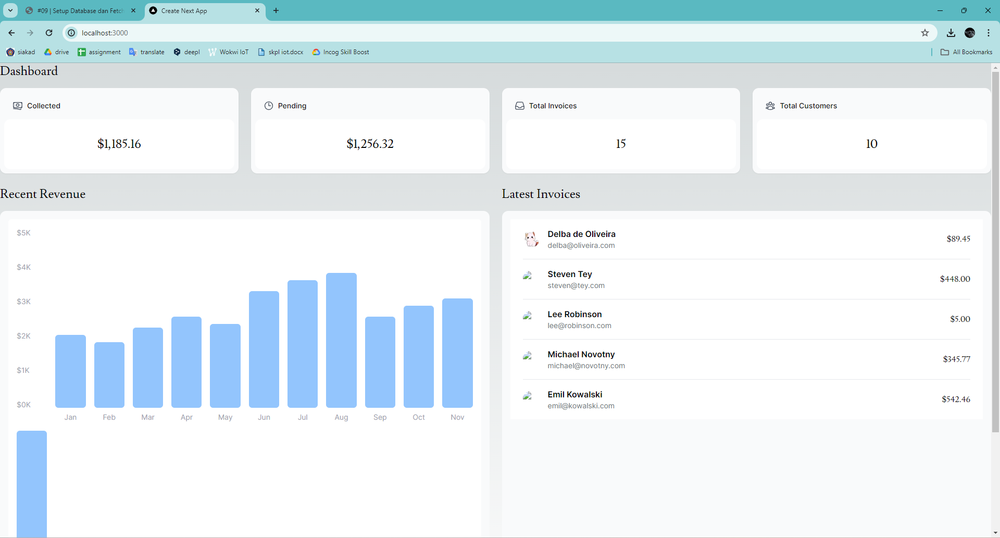

# Laporan Praktikum
| MatKul | Pemrograman Berbasis Framework |
| ---    | ---           |
| Nama   | Faricha Aulia |
| NIM    | 2141720155    |
| Kelas  | TI - 3I       |

<table><tr><td>Saya melampirkan screenshot dari setiap step yang saya lakukan pada src/assets</td></tr></table>

## Pertanyaan 1 dan Jawaban
> "Capture hasilnya dan jelaskan apa yang telah Anda pelajari dan bagaimana tampilannya saat ini?!"

Link Domain : https://fbp-09-nextjs-database.vercel.app/

**Yang saya pelajari :** 
Saya belajar bahwa Vercel adalah platform cloud yang memudahkan deployment aplikasi NextJS (dan juga React, Vue, Angular, dll). Dengan menghubungkan repositori GitHub, Vercel akan secara otomatis melakukan deployment ulang setiap kali terjadi perubahan pada branch utama (main). 

---

## Pertanyaan 2 dan Jawaban
> "Capture hasilnya dan buatlah laporan di README.md. Jelaskan apa yang telah Anda pelajari dan bagaimana tampilannya saat ini?"

**Yang saya pelajari :**
Saya belajar bahwa Vercel menyediakan layanan basis data PostgreSQL yang terintegrasi dengan platform cloud mereka. Dengan menggunakan layanan ini, kita tidak perlu mengonfigurasi server basis data secara manual, karena semuanya dikelola oleh Vercel. Selain itu, saya juga belajar tentang pentingnya memilih region basis data yang dekat dengan lokasi aplikasi kita untuk mengurangi latency pada setiap permintaan data.

---

## Pertanyaan 3 dan Jawaban
> "Capture hasilnya dan buatlah laporan di README.md. Jelaskan apa yang telah Anda pelajari dan bagaimana tampilannya saat ini?"

**Yang saya pelajari :**
Saya belajar bahwa skrip seed.js menggunakan SQL untuk membuat tabel-tabel yang dibutuhkan (invoices, customers, users, dan revenue) dan kemudian mengisi tabel-tabel tersebut dengan data awal yang didefinisikan di file data.js.

--- 

## Pertanyaan 4 dan Jawaban
> "Capture hasilnya dan buatlah laporan di README.md. Jelaskan apa yang telah Anda pelajari dan bagaimana tampilannya saat ini?"

**Yang saya pelajari :**
Saya belajar bahwa Vercel menyediakan antarmuka web yang memungkinkan kita untuk menjelajahi dan berinteraksi dengan basis data PostgreSQL secara langsung dari dashboard Vercel. Saya dapat melihat struktur tabel, data yang tersimpan di dalamnya, dan bahkan menjalankan query SQL secara langsung melalui tab "Query".

---

## Pertanyaan 5 dan Jawaban 
> "Lakukan push, kemudian perhatikan di akun dashboard Vercel project Anda. Capture hasilnya dan buatlah laporan di README.md. Jelaskan apa yang telah Anda pelajari dan bagaimana tampilannya saat ini?"

Link Domain : https://fbp-09-nextjs-database.vercel.app/

**Yang saya pelajari :**
Saya belajar bahwa Vercel menyediakan fitur deployment otomatis yang sangat memudahkan proses pengembangan aplikasi. Dengan adanya fitur ini, kita tidak perlu melakukan deployment secara manual setiap kali terjadi perubahan kode.

---

## Pertanyaan 6 dan Jawaban 
> "Capture hasilnya dan buatlah laporan di README.md. Jelaskan apa yang telah Anda pelajari dan bagaimana tampilannya saat ini?"

**Yang saya pelajari :**
Saya belajar bahwa komponen LatestInvoices mengambil data dari database menggunakan kueri SQL yang dioptimalisasi. Kueri SQL yang digunakan hanya mengambil 5 baris data invoice terakhir yang diurutkan berdasarkan tanggal. Ini lebih efisien daripada mengambil semua data invoice dan memfilternya di sisi klien (JavaScript).

----

## Pertanyaan 7 dan Jawaban 
> "Capture hasilnya dan buatlah laporan di README.md. Jelaskan apa yang telah Anda pelajari dan bagaimana tampilannya saat ini?"

**Yang saya pelajari :**
Saya belajar bahwa aset gambar atau file statis lainnya harus disertakan dalam project agar dapat ditampilkan dengan benar pada aplikasi web. Selain itu, ukuran file juga perlu diperhatikan untuk mempercepat waktu loading aplikasi.

---

## Tugas Praktikum dan Jawaban 
> "Perhatikan fungsi fetchCardData() (pada file src\model\query.tsx) dari soal nomor 1. Jelaskan maksud kode dan kueri yang dilakukan dalam fungsi tersebut!"

**Yang saya pelajari :**
Baik, saya akan menjelaskan maksud dari kode dan kueri yang dilakukan dalam fungsi fetchCardData() pada file src/model/query.tsx.
Fungsi fetchCardData() bertujuan untuk mengambil beberapa data statistik yang akan ditampilkan pada kartu-kartu informasi di dashboard aplikasi. Data statistik yang diambil meliputi jumlah total invoice, jumlah total pelanggan, total jumlah invoice yang telah dibayar, dan total jumlah invoice yang masih pending.
